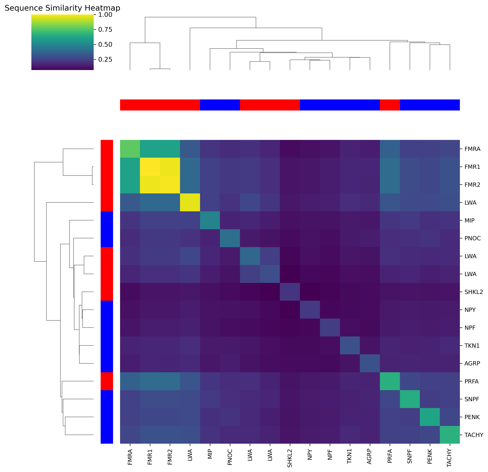

# Comparative clustering of neuropeptide sequences across metazoans

## Background

Neuropeptides are key signalling molecules in animal nervous systems. Their evolutionary origins, particularly in early-diverging lineages such as cnidarians, remain incompletely understood.

Understanding how these peptides diversify provides insight into the emergence and evolution of nervous systems across metazoans.

This project explores whether sequence similarity alone can reveal meaningful clustering patterns across neuropeptides from different animal groups.

## Dataset
- **Cnidaria**: RFamide and LWamide neuropeptides
- **Bilateria**: Neuropeptides from Homo sapiens, Mus musculus and Drosophila melanogaster
- All sequences obtained from UniProt
## Methods
- Pairwise sequence alignment using **Biopython**
- Construction of a smiliarity matrix
- Hierarchical clustering (average linkage)
- Visualization using a clustered heatmap
## Results
The clustered heatmap below shows similarity relationships across selected neuropeptides:

**Key Insights**
- **Conserved peptide families**:RFamide neuropeptides cluster strongly, indicating conserved sequence motifs within cnidarians
- **Bilaterian grouping**: Neuroppetides from bilaterian species form distinct clusters, reflecting functional and evolutionary similarity
- **Evolutionary divergence**: Cross-group similarity between cnidarian and bilaterian peptides is generally low, consistent with early divergece in neuropeptide evolution
## Limitations
- Small dataset size
- Sequence similarity alone may not capture functional relationships
- Rapid evolution of neuropeptides limits alignment-based inference
## Future Directions
- Incorporate structural predictions (e.g. receptor-ligand interactions)
- Expand dataset to include additional early-divergin gtaxa
- Use more sensitive similarity metrics or motif-based approaches
